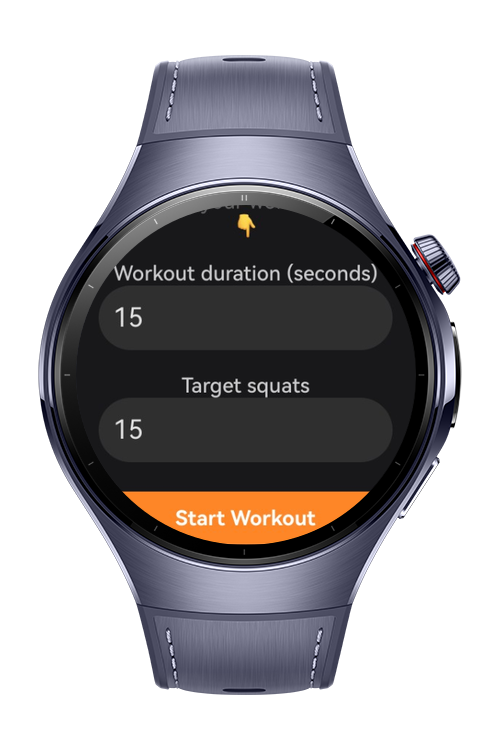
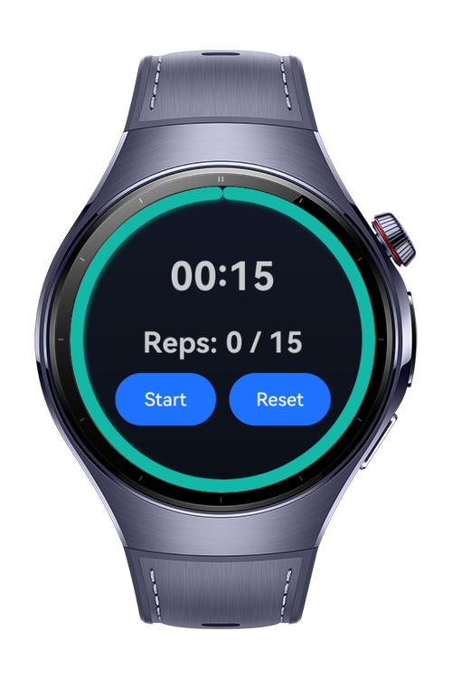
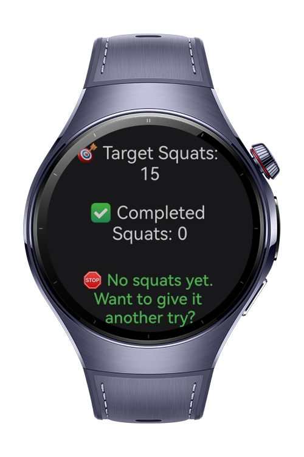

> **Note:** To access all shared projects, get information about environment setup, and view other guides, please visit [Explore-In-HMOS-Wearable Index](https://github.com/Explore-In-HMOS-Wearable/hmos-index).

# HIIT Squat Trainer
A HarmonyOS ArkTS wearable app for high-intensity interval training focused on squats. Tracks reps via accelerometer, manages session by user-defined duration and target, and provides a clean, scrollable UI with smooth navigation. On-device only—no backend.

# Preview
<div>
     
     
     
    
</div>

# Use Cases
- Set workout duration (seconds) and squat target
- Track squat repetitions in real time via accelerometer
- View live session stats (timer, current/target reps) and final results
- Navigate between pages with animated slide transitions

# Technology

## Stack
- **Languages:** ArkTS (TypeScript)
- **UI:** ArkUI (`@kit.ArkUI`)
- **Tools/IDE:** DevEco Studio **5.1.0.260**
- **SDK:** HarmonyOS SDK **5.1.0.54**
- **Libraries:** Built-in kits only
- **Sensors:** Accelerometer (SensorServiceKit)
- **Animation:** Optional Lottie splash

## Required Permissions
- `ohos.permission.ACCELEROMETER`

# Directory Structure
```
entry/
└── ets/
    ├── animation/
    │   └── LottieAnimation.ets
    ├── core/
    │   └── services/
    │       ├── TimerService.ets
    │       └── NavigationService.ets
    ├── pages/
    │   ├── SplashPage.ets
    │   ├── Index.ets
    │   ├── MainPage.ets
    │   └── DetailPage.ets
    └── util/
        └── ConstantUI.ets
```

# Constraints and Restrictions

## Supported Device
- Huawei Watch 5

## App Limits
- On-device processing (no backend)
- Foreground workout tracking
- Optimized for wearables
- ArkUI Navigation with slide transitions

# License
**HIIT Squat Trainer** is distributed under the terms of the MIT License  
See the [LICENSE](./LICENSE) for more information.
